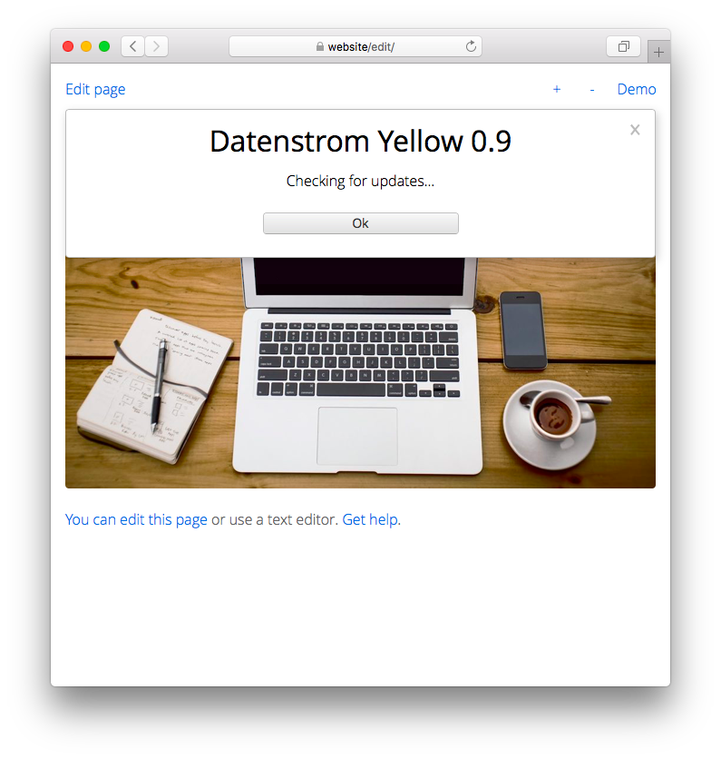

<a href="README-de.md">Deutsch</a> &nbsp; <a href="README.md">English</a> &nbsp; <a href="README-sv.md">Svenska</a>

# Update 0.9.5

Webseite auf dem neusten Stand halten.

## Wie man Erweiterungen installiert

Du kannst Erweiterungen als ZIP-Dateien herunterladen und in dein `system/extensions`-Verzeichnis kopieren. Entpacke die ZIP-Dateien nicht, sondern lasse sie unverändert. Öffnen deine Webseite im Webbrowser und klicke auf "Neu laden". Du kannst Erweiterungen auch in der [Befehlszeile](https://github.com/annaesvensson/yellow-core/tree/main/README-de.md) installieren. Öffne ein Terminalfenster. Gehe ins Installations-Verzeichnis, dort wo sich die Datei `yellow.php` befindet. Gib ein `php yellow.php install` gefolgt von weiteren Argumenten.

Du findest [verfügbare Erweiterungen auf der Webseite](https://datenstrom.se/de/yellow/extensions/), [experimentelle Erweiterungen auf GitHub](https://github.com/topics/datenstrom-yellow) und [Codeberg](https://codeberg.org/explore/repos?q=datenstrom-yellow&topic=1).

## Wie man Erweiterungen deinstalliert

Du kannst Erweiterungen als PHP-Dateien manuell entfernen. Du kannst Erweiterungen auch in der [Befehlszeile](https://github.com/annaesvensson/yellow-core/tree/main/README-de.md) deinstallieren. Öffne ein Terminalfenster. Gehe ins Installations-Verzeichnis, dort wo sich die Datei `yellow.php` befindet. Gib ein `php yellow.php uninstall` gefolgt von weiteren Argumenten.

## Wie man Erweiterungen anzeigt

Du kannst die aktuelle Version deiner Webseite im [Webbrowser](https://github.com/annaesvensson/yellow-edit/tree/main/README-de.md) anzeigen. Melde dich mit deinem Benutzerkonto an. Gehe in die Einstellungen. Du kannst die aktuelle Version auch in der [Befehlszeile](https://github.com/annaesvensson/yellow-core/tree/main/README-de.md) anzeigen. Öffne ein Terminalfenster. Gehe ins Installations-Verzeichnis, dort wo sich die Datei `yellow.php` befindet. Gib ein `php yellow.php about`. 

Du kannst Abkürzungen verwenden, um Informationen über die Webseite anzuzeigen:

`[yellow about]` für installierte Erweiterungen  
`[yellow release]` für installierte Produktversion  
`[yellow log]` für neueste Einträge in der Logdatei `system/extensions/yellow-website.log`  

## Wie man eine Webseite aktualisiert

Die erste Möglichkeit besteht darin, deine Webseite im [Webbrowser](https://github.com/annaesvensson/yellow-edit/tree/main/README-de.md) zu aktualisieren. Melde dich mit deinem Benutzerkonto an. Gehe in die Einstellungen und suche nach Aktualisierungen. Deine Webseite zeigt an, ob Aktualisierungen verfügbar sind. Du benötigst Update-Rechte, um eine Webseite zu aktualisieren. Alle Benutzerkonten werden in der Datei `system/extensions/yellow-user.ini` gespeichert.

Die zweite Möglichkeit besteht darin, deine Webseite in der [Befehlszeile](https://github.com/annaesvensson/yellow-core/tree/main/README-de.md) zu aktualisieren. Öffne ein Terminalfenster. Gehe ins Installations-Verzeichnis, dort wo sich die Datei `yellow.php` befindet. Gib ein `php yellow.php update`. Das zeigt an ob Aktualisierungen verfügbar sind. Zum Aktualisieren der Webseite gib ein `php yellow.php update all`. Du kannst wahlweise den Namen einer Erweiterung angeben. 

Falls Dateien gelöscht werden, kannst du sie im `system/trash`-Verzeichnis wiederfinden.

## Beispiele

Inhaltsdatei mit installierten Erweiterungen:

    ---
    Title: Beispiel-Seite
    ---
    Diese Seite zeigt die installierten Erweiterungen.

    ! {.important}
    ! [yellow about]

Inhaltsdatei mit installierter Produktversion:

    ---
    Title: Beispiel-Seite
    ---
    Diese Seite zeigt die installierte Produktversion.

    ! {.important}
    ! [yellow release]

Inhaltsdatei mit Logdatei:

    ---
    Title: Beispiel-Seite
    ---
    Diese Seite zeigt die neuesten Einträge in der Logdatei.

    ! {.important}
    ! [yellow log]

Erweiterungen in der Befehlszeile installieren:

`php yellow.php install`  
`php yellow.php install gallery`  
`php yellow.php install english german swedish`  

Erweiterungen in der Befehlszeile deinstallieren:

`php yellow.php uninstall`  
`php yellow.php uninstall gallery`  
`php yellow.php uninstall english german swedish`  

Erweiterungen in der Befehlszeile anzeigen:
 
`php yellow.php about`  
`php yellow.php about gallery`  
`php yellow.php about english german swedish`  

Aktualisierungen in der Befehlszeile anzeigen:
 
`php yellow.php update`  

Webseite in der Befehlszeile aktualisieren:
 
`php yellow.php update all`  

## Einstellungen

Die folgenden Einstellungen können in der Datei `system/extensions/yellow-system.ini` vorgenommen werden:

`UpdateCurrentRelease` = installierte Produktversion  
`UpdateAvailableUrl` = URL mit Aktualisierungen, `auto` für automatische Erkennung  
`UpdateAvailableFile` = Datei mit Aktualisierungseinstellungen für verfügbare Erweiterungen  
`UpdateInstalledFile` = Datei mit Aktualisierungseinstellungen für installierte Erweiterungen  
`UpdateExtensionFile` = Datei mit Erweiterungseinstellungen  
`UpdateEventPending` = ausstehende Ereignisse  
`UpdateEventDaily` = Zeitpunkt des nächsten täglichen Ereignisses  
`UpdateTrashTimeout` = Speicherung von gelöschten Dateien in Sekunden  

Die [Aktualisierungseinstellungen für verfügbare Erweiterungen](https://raw.githubusercontent.com/datenstrom/yellow/main/system/extensions/update-available.ini) findet man auch auf GitHub.

## Danksagung

Diese Erweiterung verwendet [curl](https://github.com/curl/curl) von Daniel Stenberg. Danke für die nützliche Bibliothek.

## Entwickler

Anna Svensson. [Hilfe finden](https://datenstrom.se/de/yellow/help/).
