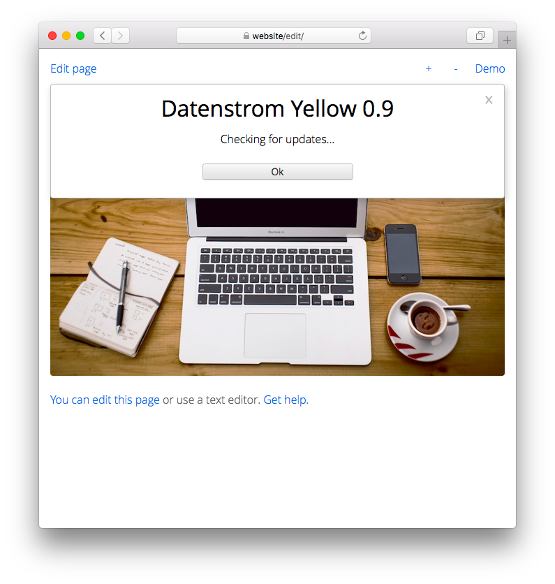

<a href="README-de.md">Deutsch</a> &nbsp; <a href="README.md">English</a> &nbsp; <a href="README-sv.md">Svenska</a>

# Update 0.9.5

Håll din webbplats uppdaterad.

## Hur man installerar tillägg

Du kan ladda ner tillägg som ZIP-filer och kopiera dem till din `system/extensions` mapp. Packa inte upp ZIP-filer, lämna dem oförändrade. Öppna din webbplats i en webbläsare och klicka på "Ladda om". Du kan också installera tillägg på [kommandoraden](https://github.com/annaesvensson/yellow-core/tree/main/README-sv.md). Öppna ett terminalfönster. Gå till installationsmappen där filen `yellow.php` finns. Skriv `php yellow.php install` följt av fler argument.

Du kan hitta [tillägg på officiella webbplatsen](https://datenstrom.se/sv/yellow/extensions/), experimentella tillägg på [GitHub](https://github.com/topics/datenstrom-yellow) och [Codeberg](https://codeberg.org/explore/repos?q=datenstrom-yellow&topic=1).

## Hur man avinstallerar tillägg

Du kan manuellt ta bort tillägg som PHP-filer. Du kan också avinstallera tillägg på [kommandoraden](https://github.com/annaesvensson/yellow-core/tree/main/README-sv.md). Öppna ett terminalfönster. Gå till installationsmappen där filen `yellow.php` finns. Skriv `php yellow.php uninstall` följt av fler argument.

## Hur man visar tillägg

Du kan visa den aktuella versionen av din webbplats i en [webbläsare](https://github.com/annaesvensson/yellow-edit/tree/main/README-sv.md). Logga in med ditt användarkonto. Gå till inställningarna. Du kan också visa den aktuella versionen på [kommandoraden](https://github.com/annaesvensson/yellow-core/tree/main/README-sv.md). Öppna ett terminalfönster. Gå till installationsmappen där filen `yellow.php` finns. Skriv `php yellow.php about`.

Du kan använda förkortningar för att visa information om webbplatsen:

`[yellow about]` för installerade tillägg  
`[yellow release]` för installerad produktversion  
`[yellow log]` för senaste poster i loggfilen `system/extensions/yellow-website.log`  

## Hur man uppdaterar en webbplats

Det första alternativet är att uppdatera din webbplats i en [webbläsare](https://github.com/annaesvensson/yellow-edit/tree/main/README-sv.md). Logga in med ditt användarkonto. Gå till inställningarna och leta efter uppdateringar. Din webbplats kommer att visas om uppdateringar är tillgängliga. Du måste ha uppdateringsrättigheter för att uppdatera en webbplats. Alla användarkonton lagras i filen `system/extensions/yellow-user.ini`.

Det andra alternativet är att uppdatera din webbplats på [kommandoraden](https://github.com/annaesvensson/yellow-core/tree/main/README-sv.md). Öppna ett terminalfönster. Gå till installationsmappen där filen `yellow.php` finns. Skriv `php yellow.php update`. Detta kommer att visa om det finns uppdateringar tillgängliga. För att uppdatera din webbplats skriv `php yellow.php update all`. Du kan eventuellt lägga till namnet på ett tillägg.

Om filer raderas kan du hitta dem i `system/trash` mappen. 

## Exempel

Innehållsfil med installerade tillägg:

    ---
    Title: Exempelsida
    ---
    Den här sidan visar de installerade tilläggen.

    ! {.important}
    ! [yellow about]

Innehållsfil med installerad produktversion:

    ---
    Title: Exempelsida
    ---
    Den här sidan visar den installerade produktversionen.

    ! {.important}
    ! [yellow release]

Innehållsfil med loggfil:

    ---
    Title: Exempelsida
    ---
    Den här sidan visar de senaste posterna i loggfilen.

    ! {.important}
    ! [yellow log]

Installera tillägg på kommandoraden:

`php yellow.php install`  
`php yellow.php install gallery`  
`php yellow.php install english german swedish`  

Avinstallera tillägg på kommandoraden:

`php yellow.php uninstall`  
`php yellow.php uninstall gallery`  
`php yellow.php uninstall english german swedish`  

Visa tillägg på kommandoraden:
 
`php yellow.php about`  
`php yellow.php about gallery`  
`php yellow.php about english german swedish`  

Visa uppdateringar på kommandoraden:
 
`php yellow.php update`  

Uppdatera webbplats på kommandoraden:
 
`php yellow.php update all`  

## Inställningar

Följande inställningar kan konfigureras i filen `system/extensions/yellow-system.ini`:

`UpdateCurrentRelease` = installerad produktversion  
`UpdateAvailableUrl` = URL med uppdateringar, `auto` för automatisk detektering  
`UpdateAvailableFile` = fil med uppdateringsinställningar för tillgängliga tillägg  
`UpdateInstalledFile` = fil med uppdateringsinställningar för installerade tillägg  
`UpdateExtensionFile` = fil med tilläggsinställningar  
`UpdateEventPending` = väntande händelser  
`UpdateEventDaily` = tid för nästa dagliga händelse  
`UpdateTrashTimeout` = lagring av raderade filer i sekunder  

[Uppdateringsinställningarna för tillgängliga tillägg ](https://raw.githubusercontent.com/datenstrom/yellow/main/system/extensions/update-available.ini) finns också på GitHub.

## Tack

Detta tillägg använder [curl](https://github.com/curl/curl) av Daniel Stenberg. Tack för det användbara biblioteket.

## Utvecklare

Anna Svensson. [Få hjälp](https://datenstrom.se/sv/yellow/help/).
