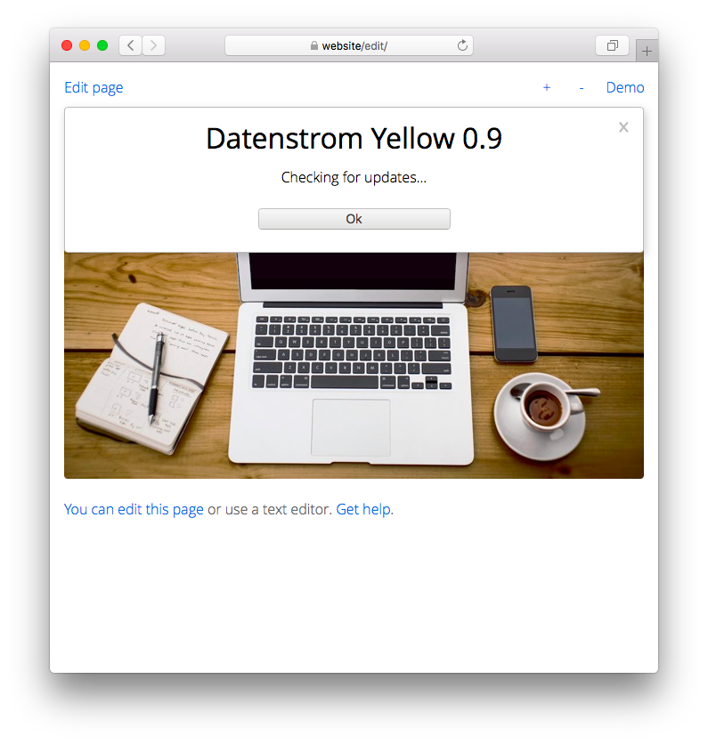

# Update 0.9.8

Håll dina tillägg uppdaterade. Utvecklad av Anna Svensson.

## Hur man installerar tillägg

Du kan ladda ner tillägg som ZIP-filer och kopiera dem till din `system/extensions` mapp. Packa inte upp ZIP-filer, lämna dem oförändrade. Öppna din webbplats i en webbläsare och klicka på "Ladda om". Du kan också installera tillägg på [kommandoraden](https://github.com/annaesvensson/yellow-core/tree/main/readme-sv.md). Öppna ett terminalfönster. Gå till installationsmappen där filen `yellow.php` finns. Skriv `php yellow.php install` följt av fler argument.

Det finns [tillägg på officiella webbplatsen](https://datenstrom.se/sv/yellow/extensions/). Det finns experimentella tillägg på [Codeberg](https://codeberg.org/explore/repos?q=datenstrom-yellow&topic=true&sort=moststars), [GitHub](https://github.com/topics/datenstrom-yellow) och andra Git-hostingplattformar. Tänk på att endast tillägg som är tillgängliga på den officiella webbplatsen kommer att ingå i uppdateringsmekanismen, eventuellt måste du uppdatera experimentella tillägg manuellt. Du kan bestämma om du vill använda experimentella tillägg på din webbplats eller inte.

## Hur man uppdaterar tillägg

Det första alternativet är att uppdatera tillägg i en [webbläsare](https://github.com/annaesvensson/yellow-edit/tree/main/readme-sv.md). Logga in med ditt användarkonto. Gå till inställningarna och leta efter uppdateringar. Din webbplats kommer att visas om uppdateringar är tillgängliga. Du måste ha uppdateringsrättigheter för att uppdatera tillägg. Alla användarkonton lagras i filen `system/extensions/yellow-user.ini`.

Det andra alternativet är att uppdatera tillägg på [kommandoraden](https://github.com/annaesvensson/yellow-core/tree/main/readme-sv.md). Öppna ett terminalfönster. Gå till installationsmappen där filen `yellow.php` finns. Skriv `php yellow.php update`. Detta kommer att visa om det finns uppdateringar tillgängliga. För att uppdatera alla tillägg skriv `php yellow.php update all`. Du kan valfritt lägga till namnet på ett tillägg.

Det tredje alternativet är att uppdatera tillägg manuellt. Ladda ner tillägg som ZIP-filer och kopiera dem till din `system/extensions` mapp. Packa inte upp ZIP-filer, lämna dem oförändrade. Öppna din webbplats i en webbläsare och klicka på "Ladda om". Detta är det enda sättet att uppdatera experimentella tillägg.

## Hur man avinstallerar tillägg

Du kan manuellt ta bort tillägg som PHP-filer. Du kan också avinstallera tillägg på [kommandoraden](https://github.com/annaesvensson/yellow-core/tree/main/readme-sv.md). Öppna ett terminalfönster. Gå till installationsmappen där filen `yellow.php` finns. Skriv `php yellow.php uninstall` följt av fler argument.

Om filer raderas kan du hitta dem i `system/trash` mappen. 

## Hur man visar tillägg

Du kan visa den aktuella versionen av din webbplats i en [webbläsare](https://github.com/annaesvensson/yellow-edit/tree/main/readme-sv.md). Logga in med ditt användarkonto. Gå till inställningarna. Du kan visa de installerade tilläggen på [kommandoraden](https://github.com/annaesvensson/yellow-core/tree/main/readme-sv.md). Öppna ett terminalfönster. Gå till installationsmappen där filen `yellow.php` finns. Skriv `php yellow.php about`. Du kan valfritt lägga till namnet på ett tillägg.

Du kan använda `[about]`-förkortningen för att visa installerade tillägg.

## Exempel

Innehållsfil med installerade tillägg:

    ---
    Title: Exempelsida
    ---
    Den här sidan visar de installerade tilläggen.

    [about]

Installera tillägg på kommandoraden:

`php yellow.php install`  
`php yellow.php install gallery`  
`php yellow.php install english german swedish`  

Uppdatera tillägg på kommandoraden:
 
`php yellow.php update`  
`php yellow.php update all`  
`php yellow.php update english german swedish`  

Avinstallera tillägg på kommandoraden:

`php yellow.php uninstall`  
`php yellow.php uninstall gallery`  
`php yellow.php uninstall english german swedish`  

Visa tillägg på kommandoraden:
 
`php yellow.php about`  
`php yellow.php about gallery`  
`php yellow.php about english german swedish`  

## Inställningar

Följande inställningar kan konfigureras i filen `system/extensions/yellow-system.ini`:

`UpdateCurrentRelease` = installerad produktversion  
`UpdateAvailableUrl` = URL med uppdateringar, `auto` för automatisk detektering  
`UpdateAvailableFile` = fil med uppdateringsinställningar för tillgängliga tillägg  
`UpdateInstalledFile` = fil med uppdateringsinställningar för installerade tillägg  
`UpdateExtensionFile` = fil med tilläggsinställningar  
`UpdateEventPending` = väntande händelser  
`UpdateEventDaily` = tid för nästa dagliga händelse  
`UpdateTrashTimeout` = lagring av raderade filer i sekunder  

Följande filer är viktiga för uppdateringsmekanismen:

`system/extensions/update-available.ini` = [fil med uppdateringsinställningar](https://raw.githubusercontent.com/datenstrom/yellow/main/system/extensions/update-available.ini) för tillgängliga tillägg  
`system/extensions/update-installed.ini` = fil med uppdateringsinställningar för installerade tillägg  
`system/extensions/yellow-website.log` = webbplatsens loggfil  

## Tack

Detta tillägg använder [curl](https://github.com/curl/curl) av Daniel Stenberg. Tack för det användbara biblioteket.

Har du några frågor? [Få hjälp](https://datenstrom.se/sv/yellow/help/).
